# Z-score_GUI

### Phil Wilmarth, OHSU
### September 12, 2019

GUI app for doing sliding window Z-score transformations of quantitative proteomics data. This is a last resort method when there are insufficient numbers of replicates for better statistical testing methods. Summary quantitative data from two conditions are compared via expression ratios. The data are sorted from highest average abundance to lowest. A relatively small window (with a user-selected width) slides from highest abundance to lowest and does a Z-transformation of the expression ratio of the protein in the center of the window. The mean and standard deviation for the transformation are trimmed values taken from the proteins in the window. This adaptive approach removes abundance-dependent dispersion and does not require normalized data.

The distribution of Z-scores from all of the proteins are fit with a Gaussian. This allows for p-value calculations for each individual Z-score. A Benjamini-Hochberg multiple testing correction is also performed. The sliding window width and percentage of data that is trimmed (removal of large Z-scores) are user adjustable. Any missing data is replaced by a user specified value. The BH-adjusted p-values are labeled "high", "med", "low", and "no" based on a set of specified cutoffs.

The script gets its data from the clipboard and writes its results to the clipboard. Thus, the script is a natural companion to Excel where data can be prepared and the results can be viewed. After preparing data in Excel (filtering to remove contaminants, averaging data by condition, copying data to adjacent columns), the data can be copied to the clipboard, read by the script, Z-scores computed, and results pasted from clipboard back into Excel.  

---

## Launch script

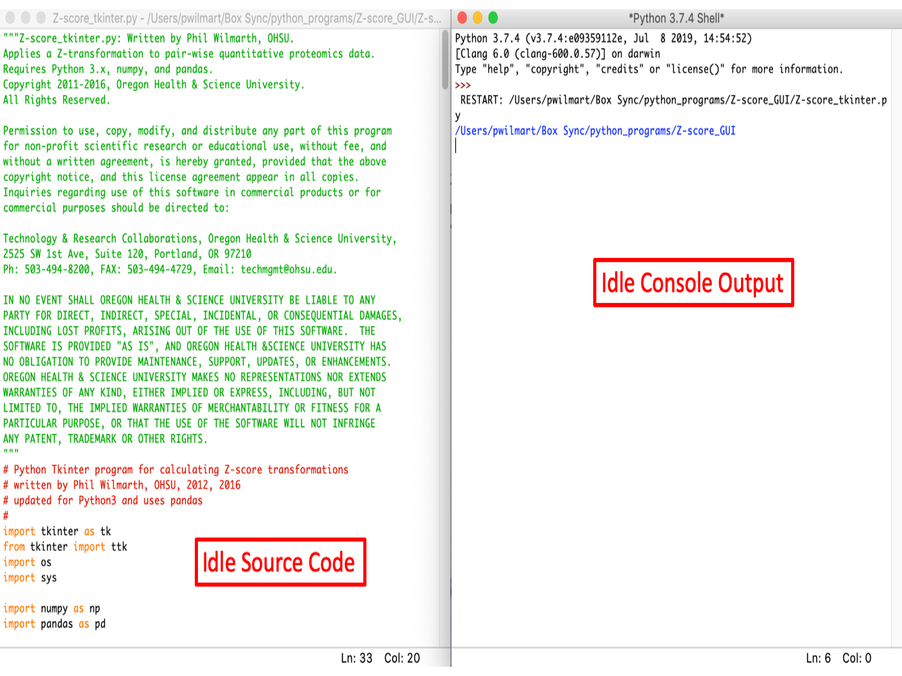

The GUI script needs Python 3. Installation from [Anaconda](https://www.anaconda.com/distribution/) or [Python.org](https://www.python.org/downloads/) are recommended. The script uses numpy, pandas, and scipy packages that are not part of the standard distribution. Those (and other) packages are included in Anaconda, but have to be added separately to a basic Python 3 installation. Some instructions for doing that can be found [here](https://scipy.org/install.html). There are several ways to launch Python scripts. I like using the built-in integrated development environment called IDLE.

----

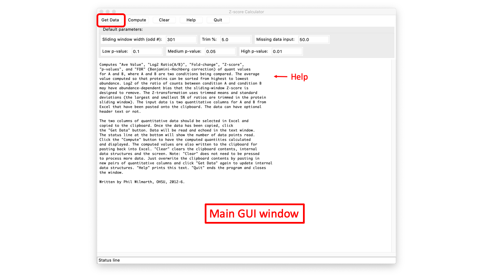

When the script runs, a GUI window will appear. The default screen has some help text. There are buttons at the top for loading data from the clipboard, computing Z-scores, clearing the session, viewing the help text, and quitting.

There are a series of text input boxes for parameters. The sliding window width should be an odd number. Larger widths are more robust, but less adaptive to the data trends. Values of 201 or 301 are as large as one needs to use. Values less than 51 are not recommended. A value around 10% of the length of the protein list is a good rule of thumb.

The trim percentage controls how much larger DE values influence the average and standard deviation. Increasing the trim value may increase the numbers of DE candidates. Values of 5% to 10% are good starting points. The trim and the number of proteins in the window are somewhat dependent. Large trim values should not be used if the window width is smaller. **NOTE:** the trim is taken from the bottom **and** from the top of the sorted Z-scores. The data used for the mean and standard deviation is 100% minus twice the trim value. A trim of 25% would remove half of the data.

If there are any missing values (zeros, NA, NaN, etc.) in the data, they will be replaced by the Missing data input value. Recommended values for spectral counting are between 0.15 and 0.5. Recommended values for TMT reporter ion intensities are in the 50 to 150 range. A good rule of thumb is something less than half of the smallest non-zero data value in the data set.

The bottom row of values are the cutoffs for DE candidate categories based on the Benjamini-Hochberg corrected p-values. The defaults are good starting points.  

---

## Copy data to clipboard

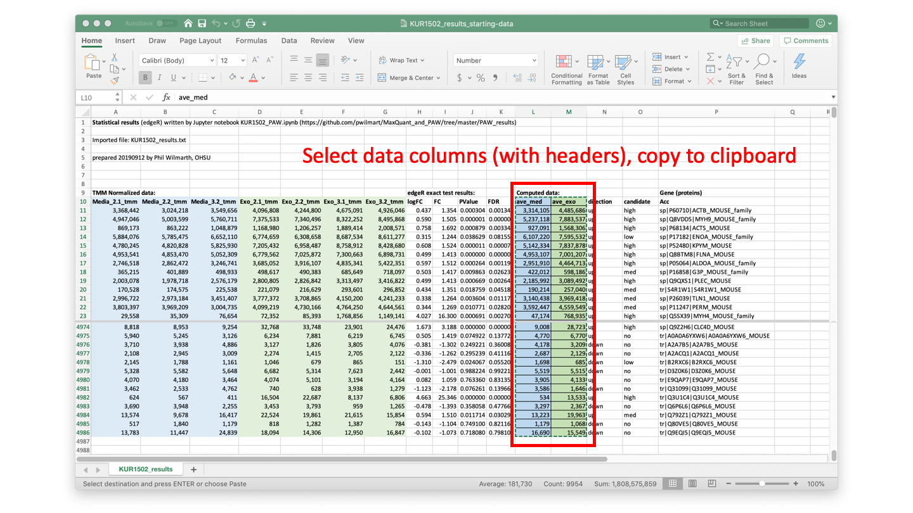

The script is designed to be used in conjunction with Excel. If you take the time to learn how to correctly use Excel, you can maximize its strengths and avoid its weaknesses. Excel is an amazing visual table manager. We need two columns of quantitative data values, one column for each condition in our pairwise comparison. This data is actually 3 replicates of the media only condition and 4 replicates of the leukemia exosome-dosed cells. We can do statistical testing (and did using edgeR). This data is from [this repo](https://github.com/pwilmart/MaxQuant_and_PAW/tree/master/PAW_results) (the `KUR1502_results.txt` file). We will take the two average intensity columns of TMM-normalized data (columns L and M). We use split view to see the top and bottom of the sheet at the same time. We want to select the 4,976 proteins in columns L and M along with the column headers, and copy the data to the clipboard.

---

## Load data and compute Z-scores

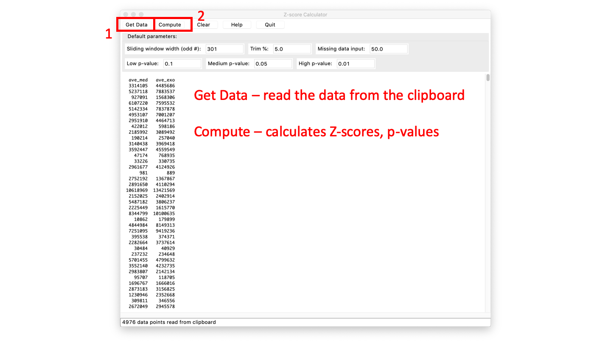

We want to go back the the Z-score GUI program window and click the `Get Data` button. We should see the data in the main GUI frame and get a new status message (lower left corner). Make any desired changes to the parameters (window width, trim percentage, etc.). Next, click the `Compute` button to calculate the Z-scores, p-values, and Benjamini-Hochberg corrected p-values. The results will go into the main GUI frame and also be written to the clipboard.

---

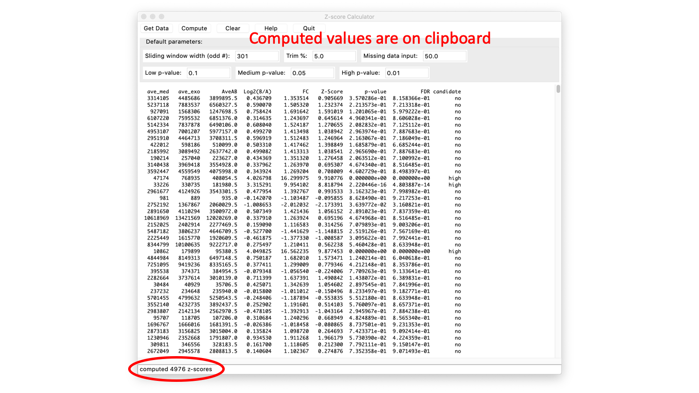

This shows the results of the computation. **Note:** your choice of parameters are not logged anywhere. You will need to manually log those (adding them to the spreadsheet somewhere is a good idea).

---

## Paste results back into Excel

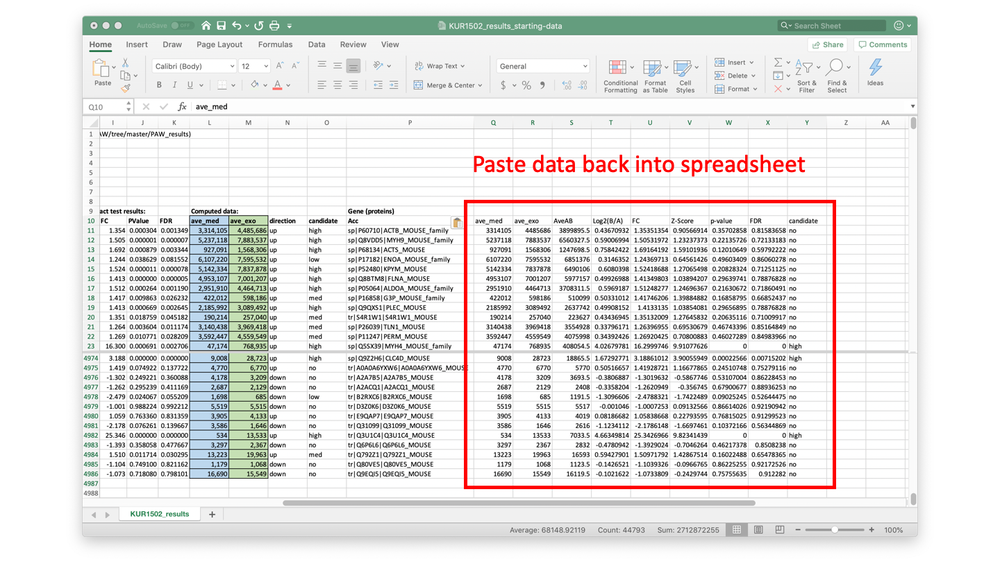

We go back to Excel and paste the results into empty columns at the right of the table.

---

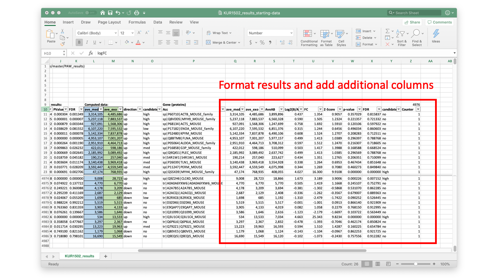

Now we can format the new columns, add any additional columns (like the counter column), and continue to summarize the results in the spreadsheet.

---

## Check the p-value distribution

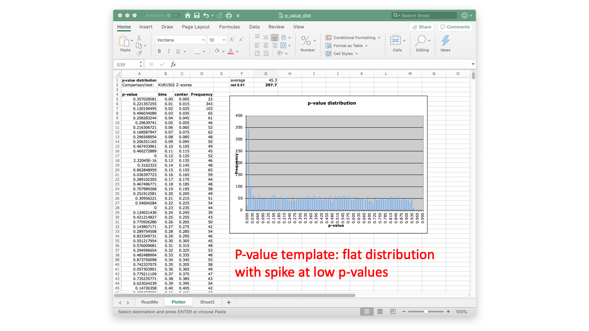

There are a couple of Excel template files for visualizing some aspects of the results. One template (`p_value_plotter.xlsx`) shows the distribution of p-values from the Z-score analysis. **Note:** these are the raw (uncorrected) p-values (column W). We expect a flat distribution from 0.0 to 1.0 for non-differentially-expressed (DE) proteins. We expect a sharp spike at low p-values from true DE candidates.

---

## Visualize the DE candidates

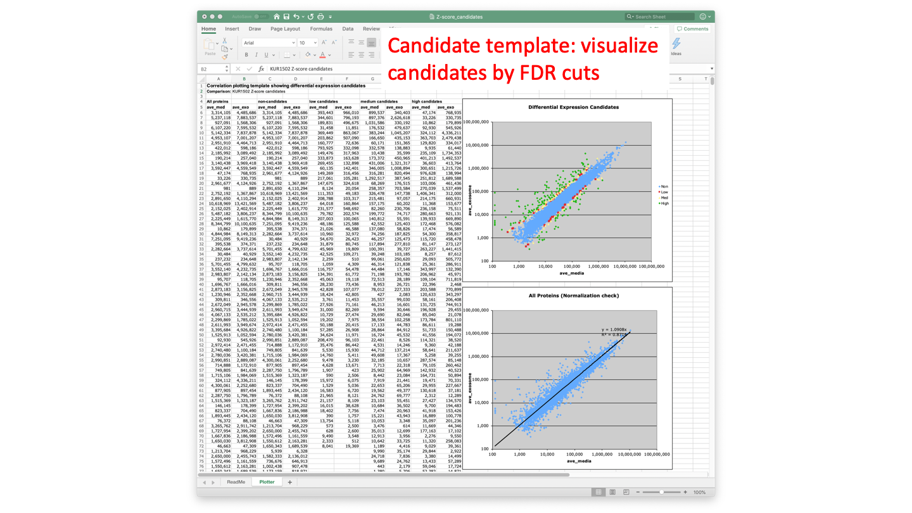

The other template (`candidate_plotter.xlsx`) will make a scatter plot of DE candidates color-coded by candidate status. There is also a plot for checking data normalizations. **Note:** the adaptive nature of the sliding window transformation does not require normalized data.

---

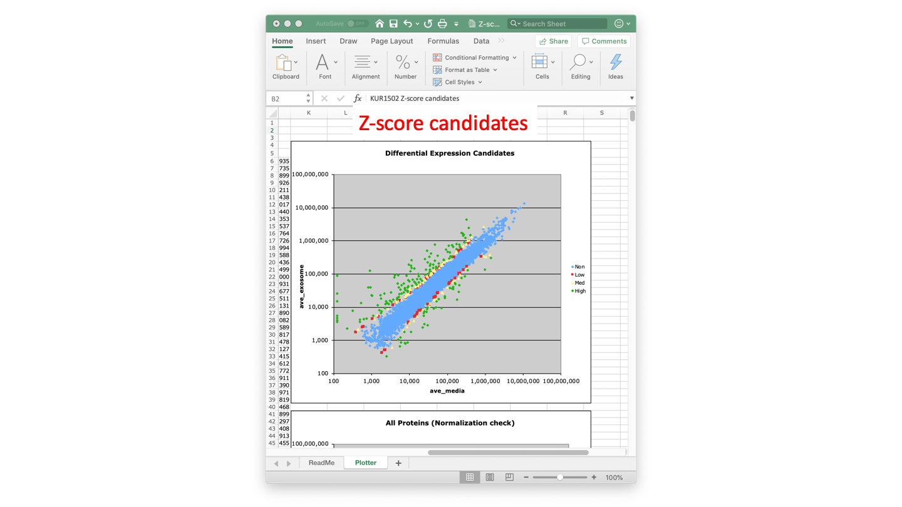

We see that the data points along the diagonal (blue points) define the non-changing background expression. How wide this is can be influenced a bit by the trim setting. Like most differential expression testing methods, we are assuming that most proteins are not differentially expressed. This Z-score method is particularly harsh when the conditions are expected to be quite different. The DE candidates will be proteins that are "off of" the diagonal. The low (red) and medium (yellow) proteins tend to be just at the edges of the non-candidates. The higher significance candidates (green) can be farther from the blue points.

---

## Comparison to edgeR results

In this example case, we had enough replicates (3 and 4) in each condition to run edgeR statistical testing. The results are very different.

---

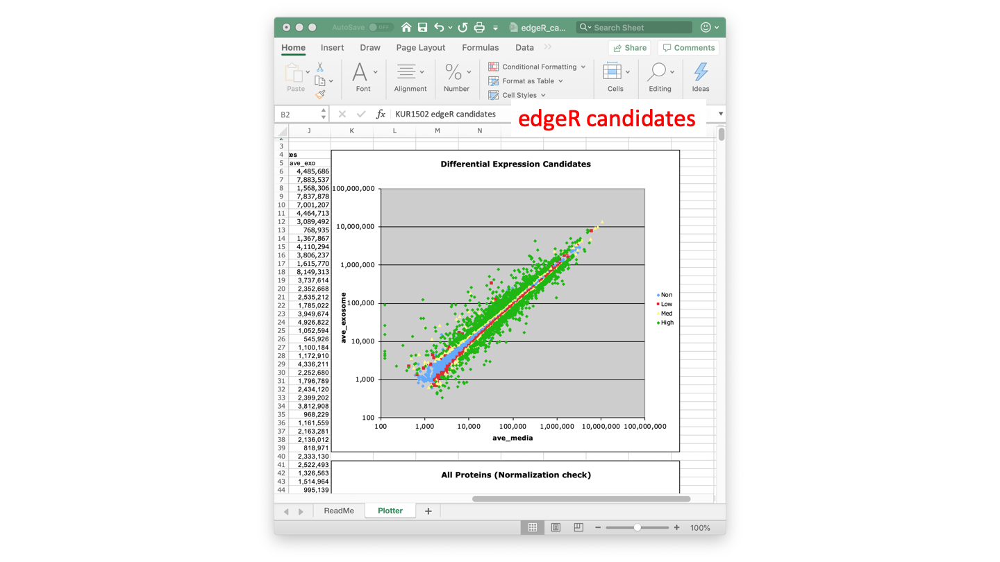

In the expanded view, we see that there are dramatically more DE candidates from edgeR. This experiment had a significant treatment effect and is not a favorable case for the Z-score assumptions. We do see that the Z-score treatment is rather conservative and that may be good in cases where there are few replicates to give confidence to the results. We can count the number of DE candidates from edgeR and from the Z-score with a couple of different trim values.

**DE Candidates by Method**

|Category|edgeR  count|Z-score 5% trim|Z-score 25% trim|
|--------|-----|---------------|----------------|
|no|2487|4664|4594|
|low|375|67|76|
|med|535|83|104|
|high|1580|162|202|

The Z-score results are not too sensitive to the trim value. A 25% trim is excluding half of the data in the window.

---

The Z-score method is a rather blunt tool. It clearly falls into the "better than nothing" tool category. Use carefully!

---
