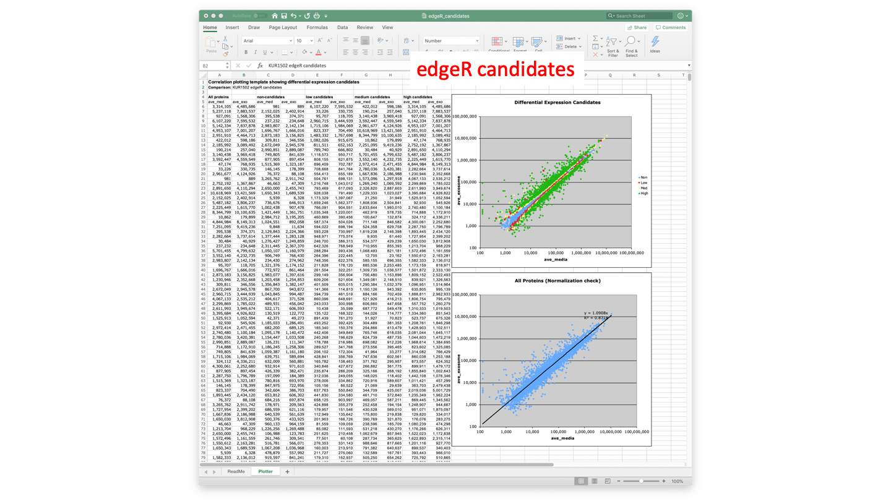

# Z-score_GUI
GUI app for doing sliding window Z-score transformations of quantitative proteomics data

---

The GUI script needs Python 3. Installation from [Python.org](https://www.python.org/downloads/) or [Anaconda](https://www.anaconda.com/distribution/) are recommended. There are several ways to launch Python scripts. I like using the built-in integrated development environment called IDLE.

----

When the script runs, a GUI window will appear. The default screen has some help text. There are buttons at the top for loading data from the clipboard, computing Z-scores, clearing the session, viewing the help text, and quitting.

There are a series of text input boxes for parameters. The sliding window width should be an odd number. Larger widths are more robust, but less adaptive to the data trends. Values of 201 or 301 are as large as one needs to use. Values less than 51 are not recommended. A value around 10% of the length of the protein list is a good rule of thumb.

The trim percentage controls how much larger DE values influence the average and standard deviation. Increasing the trim value may increase the numbers of DE candidates. Values of 5% to 10% are good starting points. The trim and the number of proteins in the window are somewhat dependent. Large trim values should not be used if the window width is smaller.

If there are any zero values in the data, they will be replaced by the Missing data input value. Recommended values for spectral counting are between 0.15 and 0.5. Recommended values for TMT reporter ion intensities are in the 50 to 150 range. A good rule of thumb is something less than half of the smallest non-zero data value in the data set.

The bottom row of values are the cutoffs for DE candidate categories based on the Benjamini-Hochberg corrected p-values. The defaults are good starting points.  

---

The script is designed to be used in conjunction with Excel. Unlike many folks, I took the time to learn how to correctly use Excel, so I do not have to avoid it for fear that I will do something stupid. Excel is a pretty amazing visual table manager. Learn to maximize its strengths and avoid its weaknesses just like every other thing you use. We need two columns of quantitative data values, one column for each condition in our pairwise comparison. This data is actually 3 replicates of the media only condition and 4 replicates of the leukemia exosome-dosed cells. We can do statistical testing (and did using edgeR). This data is from [this repo](https://github.com/pwilmart/MaxQuant_and_PAW/tree/master/PAW_results) (the `KUR1502_results.txt` file). We will take the two average intensity columns of TMM-normalized data (columns L and M). We use split view to see the top and bottom of the sheet at the same time. We want to select the 4,976 proteins in columns L and M along with the column headers, and copy the data to the clipboard.

---

We want to go back the the Z-score GUI program window and click the `Get Data` button. We should see the data in the main GUI frame and get a new status message (lower left corner). Next, click the `Compute` button to calculate the Z-scores, p-values, and Benjamini-Hochberg corrected p-values. The results will go into the main GUI frame and also be written to the clipboard.

---

This shows the results of the computation.

---

We go back to Excel and paste the results into empty columns at the right of the table.

---

Now we can format the new columns, add any additional columns (like the counter column), and continue to summarize the results in the spreadsheet.

---

There are a couple of Excel template files for visualizing some aspects of the results. One template (`p_value_plotter.xlsx`) shows the distribution of p-values from the Z-score analysis. **Note:** these are the raw (uncorrected) p-values (column W). We expect a flat distribution from 0.0 to 1.0 for non-differentially-expressed (DE) proteins. We expect a sharp spike at low p-values from true DE candidates.

---

The other template (`candidate_plotter.xlsx`) will make a scatter plot of DE candidates color-coded by candidate status. There is also a plot for checking data normalizations. **Note:** the adaptive nature of the sliding window transformation does not require normalized data.

---

caption

---

caption

---

caption

---
